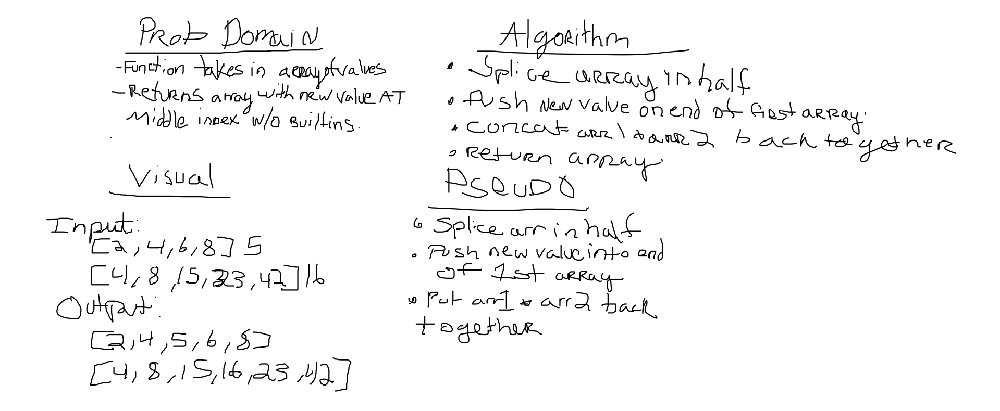

# Insert Shift Array
* Add a value to the middle of an array without any built in methods.

## Challenge
* Take and array and value to be added. Without utilizing any built in methods available to your language, return an array with the new value added at the middle index.

## Approach & Efficiency
* Split the array in half, then put the new value on the end of the first array, cocnat the arrays back together and return finished array.

## Solution

